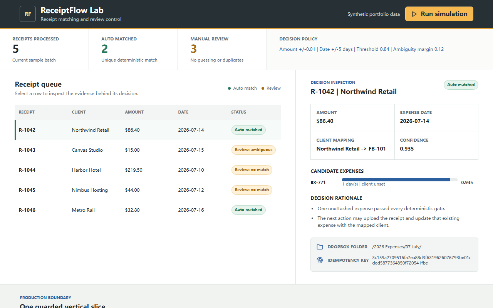
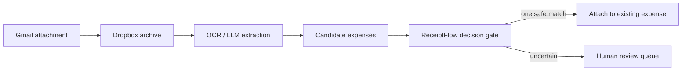

# ReceiptFlow Lab

ReceiptFlow Lab is a credential-free decision engine for safely reconciling
email receipts with existing accounting expenses. It demonstrates how an
automation can auto-match one clear candidate and route every uncertain case to
human review instead of guessing or creating a duplicate expense.



**Explore:** [live demo](https://gzh246.github.io/receiptflow-lab/) ·
[decision engine](receipt_matcher.py) ·
[synthetic input](sample_data.json) · [generated decisions](demo_output.json) ·
[dashboard source](web/) · [implementation options](#need-a-production-version)

> This is a self-initiated technical demonstration, not client work. All data
> is synthetic, and the repository contains no platform credentials or live
> customer records.

## What It Solves

Receipt automations become risky when OCR output is treated as certainty. A
plausible amount and date are not enough to justify changing accounting data.
This project keeps the uncertain extraction layer separate from a deterministic
decision policy that provides:

- date, amount, currency, attachment, and client eligibility gates;
- unique-candidate scoring with an explicit ambiguity margin;
- manual-review outcomes for no-match, low-confidence, and ambiguous cases;
- stable idempotency keys for repeated attachment events;
- predictable `/YYYY Expenses/MM Month/` archive paths; and
- machine-readable JSON suitable for an API, Make, n8n, or another orchestrator.

## Run Locally

Requirements: Python 3.10 or newer. There are no third-party Python
dependencies.

```bash
python run_demo.py
python -m unittest discover -v
python -m http.server 8765
```

Open <http://127.0.0.1:8765/>. The root page redirects to the interactive
dashboard. Stop the local server with `Ctrl+C`.

To evaluate another **non-sensitive** fixture:

```bash
python run_demo.py --input path/to/input.json --output path/to/report.json
```

The input uses the same shape as [`sample_data.json`](sample_data.json). Receipt
attachment hashes must be 64-character hexadecimal SHA-256 values, currencies
must be three-letter codes, and amounts must be positive decimal strings.

## Decision Contract

| Status | Meaning | Permitted next step |
| --- | --- | --- |
| `auto_match` | One eligible candidate clears the confidence and ambiguity gates | Attach to that existing expense |
| `manual_review_ambiguous` | Two candidates are too close | Ask a human to choose |
| `manual_review_low_confidence` | The best candidate is below threshold | Ask a human to verify |
| `manual_review_no_match` | No candidate passes every gate | Preserve evidence; do not create a duplicate |

Every decision also includes its reasons, candidate scores, archive path, and
idempotency key. Given the same input and policy, the output is deterministic.

## Architecture



The repository implements the decision gate and a browser-based evidence view.
In a production workflow, Gmail, Dropbox, OCR, an alias lookup, and FreshBooks
would remain replaceable adapters around this deterministic core.

## Repository Map

| Path | Purpose |
| --- | --- |
| `receipt_matcher.py` | Typed domain model, validation, scoring, and decisions |
| `run_demo.py` | Dependency-free command-line runner |
| `sample_data.json` | Fictional, public-safe input fixture |
| `demo_output.json` | Deterministically generated example report |
| `test_receipt_matcher.py` | Unit and reproducibility tests |
| `web/` | Responsive decision-inspection dashboard |

## Reliability And Security Boundaries

- The Python demo performs no network requests and reads no environment
  variables.
- The browser renders fixture values with `textContent`, not HTML injection.
- The demo never updates accounting data or creates an expense.
- Idempotency keys are generated here, but a production integration must store
  them transactionally before performing side effects.
- OAuth, webhook verification, retry policy, audit storage, and access control
  belong in the production adapters and deployment environment.
- Never commit real receipts, customer identifiers, tokens, or exported
  accounting records when adapting this project.

## Limitations

This repository does not perform OCR, call Gmail/Dropbox/FreshBooks, persist an
idempotency ledger, or claim production accuracy. Thresholds are illustrative
and must be calibrated against a business's review policy and representative
data before any live use.

## Need A Production Version?

The reusable core can be extended with authenticated platform adapters, an
approval queue, webhook handling, audit logs, deployment, and monitoring. To
discuss a scoped implementation, [open an implementation request](../../issues/new?template=implementation-request.yml)
with a public-safe overview of the systems and desired outcome. Do not include
credentials, personal data, or proprietary documents in a GitHub issue.
If you found this project through Upwork or another marketplace, continue all
communication and contracting on that original platform.

## License

Released under the [MIT License](LICENSE). Product and platform names mentioned
in the architecture are trademarks of their respective owners; no affiliation
or endorsement is implied.
